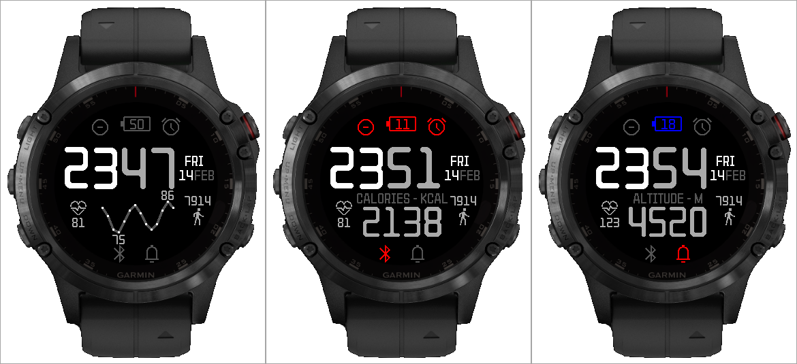
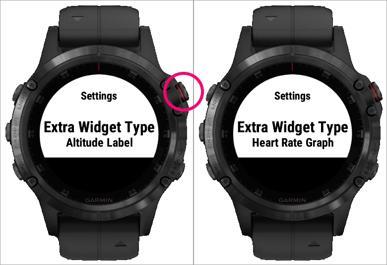

# MonoTone Watchface

A sleek, minimalist, monotone watchface designed specifically for the Garmin Fenix 5 Plus. This watchface focuses on simplicity and readability, featuring an uncluttered interface.

## Customizations

Customizations are done via on-device app settings.

## Compatibility

- Designed for Garmin Fenix 5 Plus.
- May also work with other Garmin watches that are round and have a resolution of 240x240 (Compatibility not guaranteed).

## Installation

1. **Manual Installation**:

   - Clone this repository to your local machine.
   - Set up the Garmin Connect IQ SDK on your computer. You can find installation instructions [here](https://developer.garmin.com/connect-iq/).
   - Build the project using the `monkeyc` command-line tool provided by the SDK.
   - Locate the generated `.prg` file in the build output directory.
   - Connect your Garmin Fenix 5 Plus to your computer.
   - Copy the `.prg` file into the `GARMIN/APPS` folder on your device.

# TODO: 

- Refactor (make new extraWidgets easier to implement)
- Add color themes
- Add more ExtraWidget options (including some API stuff maybe)
- Look over other possible additions
